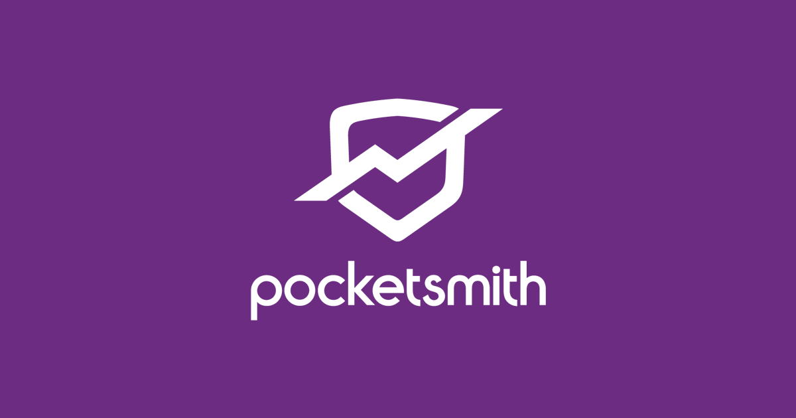

<!-- markdownlint-disable MD041 MD010 -->
<p align="center">
  
</p>

## `pocketsmith-go`

```diff
+ 📚 A Go abstraction over the Pocketsmith API: https://developers.pocketsmith.com/docs.
```

<a href="LICENSE" target="_blank"></a>
[](https://github.com/jmpa-io/pocketsmith-go/actions/workflows/cicd.yml)
[](https://github.com/jmpa-io/pocketsmith-go/actions/workflows/.github/workflows/dependabot-automerge.yml)
[](https://codecov.io/github/jmpa-io/pocketsmith-go)

## `API Coverage`

The following API endpoints are currently covered by this package:

// TODO

## `Usage`

// TODO

## `License`

This work is published under the MIT license.

Please see the [`LICENSE`](./LICENSE) file for details.
